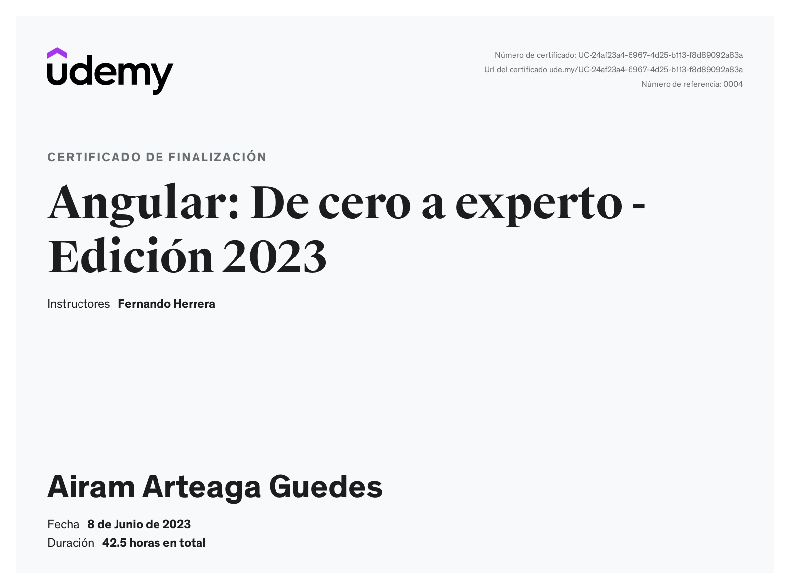

# Angular: De cero a experto - Edición 2023

Signals, componentes, directivas, servicios, mapas,, JWT, autenticación, despliegues, mongo, Git, GitHub y mucho más

Curso creado por: [Fernando Herrera](https://www.udemy.com/course/angular-fernando-herrera/#instructor-1)

Enlaces al curso de Angular de cero a experto - Edición 2023:
* [{dev/talles}](https://cursos.devtalles.com/courses/angular)
* [Udemy](https://www.udemy.com/course/angular-fernando-herrera/)

 

## Proyectos realizados

1. [Angular App](https://github.com/AAGuedes/angular-bases)
2. [Expandir Bases de Angular App](https://github.com/AAGuedes/angular-expandir-bases)
3. [Gifs App](https://github.com/AAGuedes/angular-gifs-app)
4. [Country App](https://github.com/AAGuedes/angular-countries-app)
5. [Pipes App](https://github.com/AAGuedes/angular-pipes-app)
6. [Heroes App](https://github.com/AAGuedes/angular-heroes-app)
7. [Form App](https://github.com/AAGuedes/angular-formularios-reactivos)
8. [Selectores App](https://github.com/AAGuedes/angular-formularios-reactivos-selectores)
9. [LyfeCycle App](https://github.com/AAGuedes/angular-lifecycle-hooks)
10. [Maps App](https://github.com/AAGuedes/angular-mapbox)
11. [Directive Signals App](https://github.com/AAGuedes/angular-directivas-signals)
12. [Nest Backend](https://github.com/AAGuedes/angular-mean-nest)
13. [Auth App](https://github.com/AAGuedes/angular-auth-app)
14. [Bonus: Maps App](https://github.com/AAGuedes/angular-maps-app)

 

## Certificado de finalización

